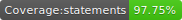
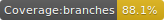
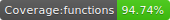
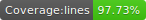

# @versum/react-native-markdown-input







Markdown input for React Native

## Notes:

If `<MarkdownInput />` is rendered in `<ScrollView />` remember to add prop `keyboardShouldPersistTaps="handled" | keyboardShouldPersistTaps="always"` to `ScrollView`

## [Docs](https://versum.github.io/react-native-markdown-input/)

## Setup

Create or add to your `.npmrc` this line:

```
@versum:registry=https://npm.pkg.github.com/
```

Then you will be able to install it through `yarn`:

```bash
yarn add @versum/react-native-markdown-input
```

## Usage

```js
import { MarkdownInput } from '@versum/react-native-markdown-input';

export default () => {
  const [value, setValue] = useState('');
  return <MarkdownInput onChangeText={setValue} value={value} />;
};
```

## Contributing

### Setup

```
yarn bootstrap
```

### Use [Example](./Example) app to test your changes. You can run it with those commands:

```
yarn example ios
yarn example android
```

### Make sure that lints and tests passes:

```
yarn lint && yarn test
```

## Publishing:

1. `yarn release <major | minor | patch | $version>`
   with proper version i.e.

```
yarn release 1.0.0
```

2. Make PR from develop to master. Release will be handled by Github Actions

## License

MIT
